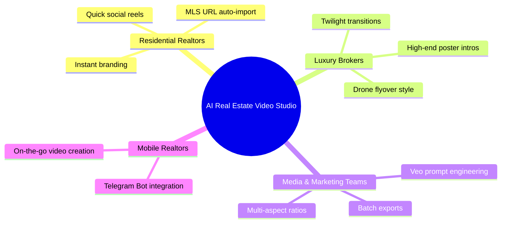
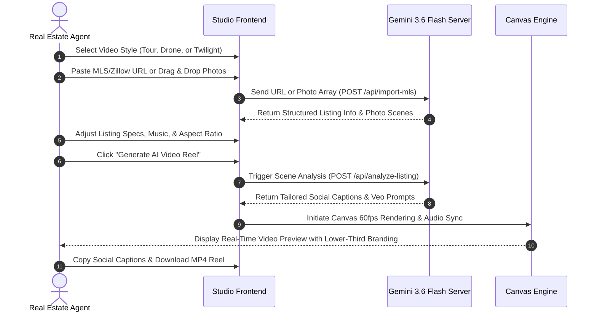

# AI Real Estate Video Studio - Functional Documentation

## 1. Executive Summary & Value Proposition

The **AI Real Estate Video Studio** is an automated video marketing platform created specifically for real estate agents, luxury property brokers, and real estate media agencies. 

Traditionally, creating high-end property video tours requires expensive videographers, long edit turnarounds (24–72 hours), and high costs ($500–$2,000 per listing). Generic AI video generators often fail because they distort room architecture, alter furniture, or introduce unnatural hallucinations.

**AI Real Estate Video Studio solves this problem by:**
1. **Preserving 100% Architectural Fidelity**: Using source listing photos as reference anchors, camera trajectories animate around actual room elements without changing walls, layout, or decor.
2. **Instant Turnaround**: Converting photos or MLS URLs into branded HD video reels in under 2 minutes.
3. **Multi-Platform Ready**: Outputting in 9:16 vertical (Instagram Reels, TikTok), 16:9 widescreen (YouTube, MLS), and 1:1 square formats with automated social captions.

---

## 2. Target User Personas



1. **Residential Real Estate Agents**: Need high-impact social media video reels for new listings without technical video editing skills.
2. **Luxury Estate Brokers**: Require cinematic twilight lighting shifts, aerial drone flyovers, and custom gold-accented brand overlays to match high-end listings.
3. **Real Estate Marketing Agencies**: Need scalable video production workflows, custom Google Veo 2.0 prompt exports, and project management dashboards.
4. **Mobile Realtors**: Prefer generating videos directly on their smartphones via instant messaging interfaces like Telegram.

---

## 3. Detailed Feature Breakdown

### 3.1 Feature 1: 3-Tier Cinematic Style Selection (`StyleSelector.tsx`)

Users choose from three specialized video styles tailored for different listing types:

```
+-----------------------------------------------------------------------------------+
|  [🏠 Interior / Exterior Tour]  |  [🚁 Aerial Drone Showcase]  |  [🌅 Dusk Twilight Glow] |
|  Ground-level walkthrough       |  High-altitude flyovers &      |  Day-to-night lighting   |
|  Ideal for residential homes    |  expansive estate grounds      |  shift & interior glow   |
+-----------------------------------------------------------------------------------+
```

- **Interior / Exterior Tour**: Smooth forward dolly pushes, room orbits, and side sliders simulating handheld gimbal walkthroughs.
- **Aerial Drone Showcase**: High-altitude flyovers, crane descents, and roof-level sweeps emphasizing property acreage and neighborhood setting.
- **Dusk Twilight Glow**: Simulates a sunset/twilight transformation where daytime exterior photos transition into indigo evening skies with glowing interior sconce lighting.

---

### 3.2 Feature 2: MLS / Zillow Import & AI Photo Quality Inspector (`PhotoUploader.tsx`)

Users can upload image files directly or paste an MLS/Zillow URL:

```
[ https://www.zillow.com/homedetails/... ]  --->  ( Import Listing )
```

#### AI Scene Classification & Quality Analysis Matrix
The system automatically inspects uploaded photos, assigns quality scores, flags defects, and selects optimal camera trajectories:

| Photo Scene Type | Quality Score | Defect Detection | Assigned Camera Motion | Focal Length |
| :--- | :--- | :--- | :--- | :--- |
| **Front Exterior** | 98 / 100 | Clear / Passed | Forward Dolly | 24mm |
| **Foyer / Entryway** | 92 / 100 | Clear / Passed | Reveal Pan | 35mm |
| **Living Room** | 96 / 100 | Clear / Passed | Slow Orbit | 24mm |
| **Gourmet Kitchen** | 94 / 100 | Clear / Passed | Slider Left to Right | 24mm |
| **Backyard & Pool** | 99 / 100 | Clear / Passed | Crane Down | 16mm |
| *(Duplicate Photo)* | 45 / 100 | ⚠️ Duplicate Flagged | *(Excluded)* | - |
| *(Out-of-Focus)* | 38 / 100 | ⚠️ Blurry Image | *(Excluded)* | - |

---

### 3.3 Feature 3: Listing Meta & Customization Controls (`ListingInfoForm.tsx`)

Users customize key property details and video specs:

- **Property Metadata**: Title, Address, Listing Price, Bedrooms, Bathrooms, Square Footage, and Property Description.
- **Aspect Ratio Selector**:
  - `9:16` Portrait (Vertical Reels / TikTok)
  - `16:9` Widescreen (YouTube / MLS Websites)
  - `1:1` Square (Instagram / Facebook Feed)
- **Audio Track Selector**: Pre-loaded licensed music tracks (Luxury Ambient, Cinematic Piano, Upbeat Modern, Sunset Chill, Drone Orchestral).
- **Target Video Duration**: 15s, 30s, 45s, or 60s.

---

### 3.4 Feature 4: Live Production Studio Canvas (`VideoStudioPlayer.tsx`)

The studio includes a real-time HTML5 Canvas animation engine:

- **Opening Title Poster Overlay**: Displays agent headshot, brokerage logo, property title, address, price, and specs in one of three styles: *Editorial*, *Glassmorphism*, or *Modern Gold*.
- **Camera Trajectory Animations**: Displays smooth 60fps pan/zoom/orbit camera motions simulating Google Veo 2.0 output.
- **Lower-Third Agent Branding Overlay**: Persistent Realtor name, phone, email, and brand color accent bar during room transitions.
- **Watermarking**: Optional custom watermark text overlay across all video frames.

---

### 3.5 Feature 5: Realtor Brand Kit Customization (`BrandKitModal.tsx`)

Realtors configure their branding elements once and apply them across all current and future projects:

- **Agent Identity**: Agent Name, Title, Phone Number, Email, and Headshot Photo URL.
- **Brokerage Identity**: Brokerage Name, Logo URL, and Office Website.
- **Color Palette**: Custom Hex Brand Color Picker (e.g., `#D4AF37` Gold, `#0F172A` Slate).
- **Poster Intro Preferences**: Enable/disable intro cover slide, customize headline, subtitle, and aesthetic style.

---

### 3.6 Feature 6: Social Caption & Veo Prompt Exporter (`VideoStudioPlayer.tsx`)

Once a video is generated, the studio provides instant export tools:

```
[ Instagram Caption ]  [ Facebook Caption ]  [ LinkedIn Caption ]  [ X Caption ]
--------------------------------------------------------------------------------
✨ JUST LISTED! Welcome to The Crestview Modern Villa located in Beverly Hills...
🏡 Features: 5 Beds | 6 Baths | 6,420 SF
DM for private showings! #BeverlyHills #LuxuryListing #DreamHome
--------------------------------------------------------------------------------
( Copy Caption )   ( Copy Google Veo 2.0 Prompt )   ( Download MP4 Video )
```

- **Platform-Tailored Captions**: Formatted with relevant line breaks, property specs, call-to-actions, and trending hashtags.
- **Google Veo 2.0 Prompt Exporter**: Raw prompt copy tool for agents who want to feed exact prompts into external AI video rendering pipelines.

---

### 3.7 Feature 7: Mobile Telegram Bot Simulator (`TelegramBotSim.tsx`)

For realtors who create videos on-the-go from their mobile phones:

- **Simulated Commands**:
  - `/start`: Initializes bot and displays main menu options.
  - `/help`: Displays guidelines for photo uploads and URL links.
  - `/newlisting`: Simulates sending listing photos or Zillow link via chat.
  - `/style`: Toggles between Tour, Drone, and Twilight styles.
  - `/generate`: Triggers instant video compilation and returns downloadable link.

---

### 3.8 Feature 8: Projects Library & Performance Metrics (`ProjectsLibrary.tsx`)

An organized repository of all created video assets:

- **Project Cards**: Displays thumbnail, title, style badge, creation date, aspect ratio, and status.
- **Engagement Metrics**: Tracks total video view count and download counts.
- **Project Management**: Quick reload into canvas editor, status filtering, and project deletion.

---

### 3.9 Feature 9: Subscription Pricing Plans (`PricingModal.tsx`)

Tiered subscription packages for individuals, teams, and enterprises:

| Plan Tier | Price | Included Videos | Major Features | Target Audience |
| :--- | :--- | :--- | :--- | :--- |
| **Starter Free** | $0 / mo | 3 Videos / mo | 720p resolution, default watermark, 16:9 & 9:16 ratios | Individual agents testing the tool |
| **Realtor Pro** | $49 / mo | Unlimited | 1080p HD, custom brand kit, zero watermark, all styles | Active real estate agents |
| **Agency Studio**| $149 / mo| Unlimited | 4K Ultra HD, multi-agent accounts, API access, Veo prompt exporter | Teams & Marketing Agencies |

---

## 4. End-to-End User Workflows



---

## 5. Graceful Fallbacks & Edge Cases

1. **Missing `GEMINI_API_KEY`**:
   - The backend catches missing environment variables and falls back smoothly to local heuristic algorithms for social caption synthesis and camera trajectory defaults.
2. **Invalid / Unreachable MLS URL**:
   - If an invalid URL is supplied, the system alerts the user and loads high-resolution default property sample data (`Montecito Coastal Estate`) without crashing.
3. **Broken Image URLs / Network Interruption**:
   - The HTML5 Canvas image loader includes cross-origin error handling and fallback background placeholders if an image fails to load.
