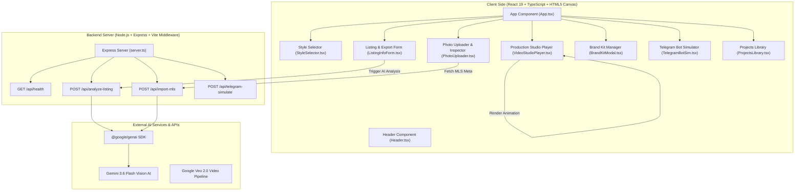

# AI Real Estate Video Studio - Technical Documentation

## 1. System Architecture & High-Level Overview

The **AI Real Estate Video Studio** is a full-stack web application powered by **React 19**, **TypeScript**, **Express**, **Google Gemini 3.6 Flash Vision AI**, and **Google Veo 2.0 Prompt Engineering**. The system converts raw real estate listing photos or MLS URLs into architectural-grade cinematic video reels with 100% property fidelity.

### 1.1 Architectural Blueprint



---

## 2. Technology Stack & Dependencies

### 2.1 Core Technologies

| Category | Technology | Version | Purpose |
| :--- | :--- | :--- | :--- |
| **Frontend Framework** | React | `^19.0.1` | UI Component rendering and reactive state |
| **UI Type System** | TypeScript | `~5.8.2` | End-to-end static type safety |
| **Build Tooling** | Vite | `^6.2.3` | Development HMR and production bundle optimizer |
| **Server Engine** | Express.js | `^4.21.2` | REST API routes and Vite middleware integration |
| **TypeScript Server Runner**| TSX | `^4.21.0` | Direct execution of TypeScript backend scripts (`server.ts`) |
| **Bundler** | ESBuild | `^0.25.0` | Production server bundling into CommonJS (`dist/server.cjs`) |
| **AI SDK** | `@google/genai` | `^2.4.0` | Official Google Gemini GenAI SDK |
| **Styling** | Tailwind CSS | `^4.1.14` | Utility-first styling framework with Vite plugin |
| **Icons** | Lucide React | `^0.546.0` | Modern, cohesive vector iconography |
| **Animation Library** | Motion | `^12.23.24` | Fluid UI component micro-interactions |
| **Environment Config** | Dotenv | `^17.2.3` | Runtime environment variable loader |

---

## 3. Backend Architecture & API Specifications (`server.ts`)

The server runs on Node.js using Express. In development, it uses Vite middleware for Hot Module Replacement (HMR). In production, it serves static built assets from the `dist/` folder.

### 3.1 Gemini Client Initialization

The backend uses lazy instantiation for the Google GenAI client to handle runtime API key configuration gracefully:

```typescript
function getGeminiClient(): GoogleGenAI {
  const apiKey = process.env.GEMINI_API_KEY;
  if (!apiKey) {
    throw new Error('GEMINI_API_KEY environment variable is missing.');
  }
  return new GoogleGenAI({
    apiKey,
    httpOptions: {
      headers: {
        'User-Agent': 'aistudio-build',
      },
    },
  });
}
```

---

### 3.2 API Endpoints Reference

#### 1. `GET /api/health`
- **Description**: Health check endpoint verifying backend operational status and Gemini key presence.
- **Response Format**:
  ```json
  {
    "status": "ok",
    "service": "AI Real Estate Video Studio Backend",
    "geminiConfigured": true,
    "timestamp": "2026-08-03T17:50:00.000Z"
  }
  ```

#### 2. `POST /api/import-mls`
- **Description**: Parses property web listing URLs (MLS, Zillow, Redfin) to extract structured property listing data and assigns curated high-resolution sample photos.
- **Request Body**:
  ```json
  {
    "url": "https://www.zillow.com/homedetails/742-Sycamore-Canyon-Rd-Montecito-CA-93108/..."
  }
  ```
- **Gemini Structured Output Schema (`Type.OBJECT`)**:
  ```typescript
  {
    title: { type: Type.STRING },
    address: { type: Type.STRING },
    price: { type: Type.STRING },
    bedrooms: { type: Type.NUMBER },
    bathrooms: { type: Type.NUMBER },
    sqft: { type: Type.NUMBER },
    description: { type: Type.STRING }
  }
  ```
- **Response Format**:
  ```json
  {
    "success": true,
    "listing": {
      "title": "Montecito Coastal Estate",
      "address": "742 Sycamore Canyon Rd, Montecito, CA 93108",
      "price": "$8,950,000",
      "bedrooms": 5,
      "bathrooms": 7,
      "sqft": 7200,
      "description": "Private Montecito sanctuary with ocean views...",
      "mlsUrl": "https://..."
    },
    "photos": [ ... ],
    "message": "Property listing and photos successfully imported."
  }
  ```

#### 3. `POST /api/analyze-listing`
- **Description**: Sends listing context and image scenes to Gemini 3.6 Flash Vision AI. Generates tailored multi-platform social media captions and engineered Google Veo 2.0 camera trajectory prompts.
- **Request Body**:
  ```json
  {
    "photos": [ ... ],
    "listingInfo": { ... },
    "videoStyle": "tour"
  }
  ```
- **AI Task**:
  1. Generate high-converting social media captions for Instagram, Facebook, LinkedIn, and X.
  2. For each scene, construct a Google Veo 2.0 prompt following the precise architectural formula.
- **Response Format**:
  ```json
  {
    "success": true,
    "analyzedPhotos": [ ... ],
    "captions": {
      "instagram": "✨ JUST LISTED! Welcome to...",
      "facebook": "🏡 NEW LISTING HIGHLIGHT...",
      "linkedIn": "Proud to present our newest listing...",
      "x": "🔥 NEW LISTING!..."
    },
    "message": "Gemini AI Vision analysis and sequence planning complete."
  }
  ```

#### 4. `POST /api/telegram-simulate`
- **Description**: Processes simulated bot interactions for mobile realtors using Telegram syntax (`/start`, `/help`, `/newlisting`, `/style`, `/generate`).

---

## 4. AI & Prompt Engineering Strategy (`src/utils/promptGenerator.ts`)

### 4.1 Google Veo 2.0 Prompt Construction Formula

To guarantee that AI-generated video models respect property architecture without introducing hallucinations (e.g., distorted walls, changing furniture), prompts follow a strict 5-part cinematographic formula:

$$\text{Veo Prompt} = \text{[Camera Motion]} + \text{[Architectural Subject]} + \text{[Lens \& Speed]} + \text{[Lighting/Style]} + \text{[Fidelity Constraints]}$$

```typescript
export function generateVeoPrompt(
  photo: Partial<PropertyPhoto>,
  listingInfo?: Partial<PropertyListingInfo>,
  style: VideoStyleId = 'tour'
): string { ... }
```

### 4.2 Camera Trajectory Specifications (`CAMERA_MOTION_SPECS`)

| Camera Motion | Default Focal Length | Default Speed | Cinematographic Trajectory Description |
| :--- | :--- | :--- | :--- |
| **Forward Dolly** | 24mm | 0.5x | Linear forward push along central axis into room with static vanishing point. |
| **Slow Orbit** | 24mm | 0.25x | 3D orbital 15°/sec sweep around key architectural feature with depth parallax. |
| **Push In** | 35mm | 0.5x | Eye-level slow zoom towards focal point with subtle background separation. |
| **Crane Down** | 16mm | 0.5x | Vertical jib descent from 8m down to 1.5m entrance level pitching up smoothly. |
| **Slider Left to Right** | 24mm | 0.5x | Horizontal track parallel to facade or counter with distinct foreground parallax. |
| **Reveal Pan** | 35mm | 0.5x | Smooth Dutch pan originating behind structural pillar or entryway archway. |
| **Tilt Up** | 16mm | 0.25x | Vertical camera tilt starting from floor surface up to double-height ceiling. |
| **Twilight Lighting Transition**| 24mm | 0.25x | Locked tripod golden-hour-to-dusk shift with warm interior sconce glow activation. |
| **High-Altitude Flyover** | 16mm | 0.5x | 45m aerial drone traverse with level horizon and smooth gimbal descent. |
| **Low-Angle Glide** | 16mm | 0.5x | Floor-level ultra-wide tracking push across polished surfaces. |

---

## 5. Frontend Architecture & Component Hierarchy

### 5.1 Data Models (`src/types.ts`)

```typescript
export type VideoStyleId = 'tour' | 'drone' | 'twilight';
export type AspectRatio = '16:9' | '9:16' | '1:1';

export interface PropertyPhoto {
  id: string;
  url: string;
  name: string;
  sceneType: SceneType;
  qualityScore: number; // 0-100
  rank: number;
  cameraMotion: CameraMotion;
  focalLength?: FocalLengthOption;
  motionSpeed?: MotionSpeedOption;
  veoPrompt?: string;
  isSelected: boolean;
  isDuplicate?: boolean;
  isBlurry?: boolean;
  reason?: string;
  twilightUrl?: string;
}

export interface BrandKit {
  agentName: string;
  agentTitle: string;
  agentPhone: string;
  agentEmail: string;
  agentPhotoUrl: string;
  brokerageName: string;
  brokerageLogoUrl: string;
  website: string;
  brandColor: string;
  showWatermark: boolean;
  watermarkText: string;
  enablePosterIntro?: boolean;
  posterHeadline?: string;
  posterSubtitle?: string;
  posterStyle?: 'editorial' | 'glassmorphism' | 'modern_gold';
}
```

### 5.2 Component Map

```
src/
├── App.tsx                     # Main Application Controller & State Engine
├── main.tsx                    # React DOM entry point
├── index.css                   # Global CSS & Tailwind imports
├── types.ts                    # TypeScript interface definitions
├── utils/
│   └── promptGenerator.ts      # Veo prompt engineering logic
├── data/
│   └── sampleListings.ts       # Preset listings, default brand kit, audio tracks
└── components/
    ├── Header.tsx              # Top navigation & API health indicator
    ├── StyleSelector.tsx       # 3-Style visual radio selector
    ├── PhotoUploader.tsx       # Drag-and-drop, MLS importer & AI Inspector
    ├── ListingInfoForm.tsx     # Property details, aspect ratio, audio track & duration
    ├── VideoStudioPlayer.tsx   # Real-time HTML5 Canvas animation & export player
    ├── ProjectsLibrary.tsx     # Video job library & performance metrics
    ├── BrandKitModal.tsx       # Realtor branding & lower-third overlay editor
    ├── TelegramBotSim.tsx      # Interactive mobile Telegram bot simulator
    └── PricingModal.tsx        # Tiered subscription plans
```

---

## 6. HTML5 Canvas Video Rendering Engine (`VideoStudioPlayer.tsx`)

The video rendering engine in `VideoStudioPlayer.tsx` simulates professional 3D camera movements natively on an HTML5 `<canvas>` element using a `requestAnimationFrame` loop.

### 6.1 Aspect Ratio Dimensions Matrix

| Aspect Ratio | Canvas Resolution (px) | Preview Frame Class | Primary Platform |
| :--- | :--- | :--- | :--- |
| `9:16` | $540 \times 960$ | `aspect-[9/16] max-w-[360px]` | Instagram Reels / TikTok / YouTube Shorts |
| `16:9` | $960 \times 540$ | `aspect-[16/9] max-w-[720px]` | YouTube / MLS / Website Hero Banner |
| `1:1` | $720 \times 720$ | `aspect-square max-w-[480px]` | Instagram Feed / Facebook Feed / LinkedIn |

### 6.2 Motion Math Algorithms

For any frame at normalized scene completion $p \in [0, 1]$:

1. **Forward Dolly (Linear Zoom)**:
   $$\text{scale}(p) = 1.0 + 0.18 \times p$$
   $$\text{offset}_x = 0, \quad \text{offset}_y = 0$$

2. **Slow Orbit (Horizontal Parallax Sweep)**:
   $$\text{scale}(p) = 1.15$$
   $$\text{offset}_x(p) = \sin(p \times \pi - \frac{\pi}{2}) \times 0.08 \times \text{width}$$

3. **Crane Down (Vertical Descent & Pitch Up)**:
   $$\text{scale}(p) = 1.10 + 0.05 \times p$$
   $$\text{offset}_y(p) = -(1.0 - p) \times 0.12 \times \text{height}$$

4. **Opening Title Poster Overlays**:
   - **Editorial**: Minimalist typography with dark vignette and gold accent rule.
   - **Glassmorphism**: Semi-transparent frosted backdrop (`rgba(15,15,15,0.75)` with 1px border).
   - **Modern Gold**: High-contrast luxury black frame with dual gold border frames (`#D4AF37`).

---

## 7. Build, Scripts & Deployment Configuration

### 7.1 Package Scripts (`package.json`)

```json
"scripts": {
  "dev": "tsx server.ts",
  "build": "vite build && esbuild server.ts --bundle --platform=node --format=cjs --packages=external --sourcemap --outfile=dist/server.cjs",
  "start": "node dist/server.cjs",
  "preview": "vite preview",
  "clean": "rm -rf dist server.cjs",
  "lint": "tsc --noEmit"
}
```

### 7.2 Environment Variable Configuration (`.env`)

```ini
# GEMINI_API_KEY: Required for Gemini Vision API & structured JSON responses
GEMINI_API_KEY="your_gemini_api_key_here"

# APP_URL: Base URL used for API routes and self-referential links
APP_URL="http://localhost:3000"
```
